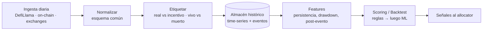

# Plataforma de datos histórica — el verdadero primer paso

Tu instinto es correcto: **no empezar por el bot, sino por los datos.** Perseguir
el APY más alto del momento es reactivo; tener 5 años de historia te deja
*distinguir edges reales de espejismos* y **backtestear** antes de arriesgar un
dólar. Este doc diseña esa plataforma.

> Objetivo: dado cualquier oportunidad (pool, vault, estrategia), responder con
> datos: *¿cuánto de su APY fue real vs incentivo? ¿cuánto duró? ¿qué le pasó
> cuando bajaron los incentivos / hubo un unlock / el mercado cayó? ¿sobrevivió?*

---

## 1. El principio que casi todos ignoran: sin sesgo de supervivencia

La mayoría de los dashboards muestran solo lo que **sigue vivo hoy**. Para
encontrar edge real hay que registrar también **lo que murió**: pools que
colapsaron, protocolos exploiteados, tokens que se desplomaron tras el unlock.

> Sin los muertos, todo backtest miente (parece que "farmear APY alto siempre
> funcionó", porque no ves a los que se fundieron). **Registrar los muertos es la
> ventaja.**

---

## 2. Modelo de datos

### Entidades (dimensiones)
- **protocols** — nombre, cadena, categoría, fecha de lanzamiento, auditorías,
  TVL histórico, exploits, tipo de riesgo.
- **pools / vaults** — protocolo, activos, fee tier, tipo (LP, CL, lending, vault),
  fecha de creación y de "muerte" (si aplica).
- **tokens** — símbolo, contrato, cadena, supply, calendario de unlocks, holders.
- **strategies** — funding, basis, lending, RWA, airdrop, etc. (para agrupar).

### Series temporales (el corazón)
Por pool/vault, granularidad diaria (o mejor):
- `apy_total`, **`apy_base`**, **`apy_reward`**  ← la separación clave
- `tvl_usd`, `volume_usd`, `fees_usd`
- `price` de cada activo, `il_estimado`
- para market-neutral: `funding_rate`, `basis`, `open_interest`

### Tablas de eventos (lo que da contexto)
- **incentive_changes** — cuándo empezó/cambió/terminó una campaña de emisiones.
- **exploits / hacks** — fecha, monto, causa (fuente: DefiLlama Hacks, Rekt).
- **depegs** — stablecoin/LST que perdió el peg, profundidad y duración.
- **token_unlocks** — fecha, % del supply, y **precio/TVL antes vs después**.
- **audits** — quién, cuándo, hallazgos.
- **governance** — cambios de parámetros que afectan el yield.

---

## 3. Fuentes (todas accesibles)

| Dato | Fuente | Notas |
|---|---|---|
| APY total/base/reward, TVL | **DefiLlama Yields** (`/pools`, `/chart/{id}`) | Ya separa `apyBase`/`apyReward`. Histórico por pool. |
| TVL protocolo, hacks | **DefiLlama** (TVL API, Hacks) | |
| Precios / volumen | CoinGecko / DEX subgraphs | |
| Estado on-chain (reservas, funding) | RPC + The Graph | Verdad de fondo |
| RWA / T-bills | **rwa.xyz** | |
| Funding rates perps | Exchanges / Coinglass | Para el sleeve neutral |
| Unlocks | TokenUnlocks / on-chain vesting | Evento crítico |
| Exploits | Rekt DB, DefiLlama Hacks | Para los "muertos" |

> Nota: DefiLlama por HTTP a veces está tras políticas de egress (nos pasó acá).
> En producción, un RPC/API propio o un mirror resuelve eso.

---

## 4. Pipeline

1. **Ingesta** — job diario (cron) que baja snapshots. Nunca borrar historia;
   append-only. Un pool que desaparece se marca `dead`, no se elimina.
2. **Normalizar** — todo a un esquema común (mismo formato de APY, TVL, activos).
3. **Etiquetar** — calcular `apy_base / apy_total` (% real), marcar campañas de
   incentivos, marcar muertes/exploits/depegs.
4. **Features** — las métricas que dan edge (sección 5).
5. **Scoring/Backtest** — primero reglas simples y transparentes, después ML.

---

## 5. Las features que dan ventaja (lo que vas a poder medir)

- **% de APY real** = `apy_base / apy_total`. El filtro #1. Un 8% base con 5.000%
  reward = un negocio de 8%.
- **Persistencia del APY** — ¿cuántos días/semanas sostuvo su nivel? Distribución,
  no un número puntual.
- **Vida media tras el pico de incentivos** — cuánto cae el APY y en cuánto tiempo
  cuando bajan las emisiones (la pregunta que mata al 99% de los pools).
- **Comportamiento post-unlock** — precio y TVL 7/30/90 días después de un unlock
  grande. (Suele ser malo; medirlo es alpha.)
- **Drawdown histórico** y recuperación.
- **Correlación entre estrategias** — para armar la cartera multi-strat de bajo
  drawdown.
- **"Time-to-rug"** — features que precedieron colapsos (TVL cayendo, holders
  concentrados, LP no bloqueada, protocolo joven sin auditoría).

Con esto, el scoring deja de ser "APY alto = bueno" y pasa a **"retorno ajustado
al riesgo, condicionado a que históricamente esto sobrevivió"**.

---

## 6. Hoja de ruta (incremental, entregable por etapas)

1. **Ingesta + almacén** — cron diario de DefiLlama Yields (`apyBase`/`apyReward`)
   + TVL, a una base append-only. *(la fundación — empezar acá)*
2. **Backfill histórico** — traer todo el `/chart/{id}` disponible por pool.
3. **Tablas de eventos** — hacks, unlocks, depegs (semilla manual + fuentes).
4. **Features + dashboard** — % real, persistencia, post-evento. Ya es útil solo
   para *elegir* mejor manualmente.
5. **Backtest harness** — "si hubiera aplicado la regla X en los últimos 3 años,
   ¿qué retorno/drawdown habría tenido?" Con los muertos incluidos.
6. **Scoring → allocator** — conectar al sistema de rotación de `STRATEGY.md`.
7. **ML (después)** — solo cuando haya datos limpios y un baseline de reglas que
   batir. El ML sin datos buenos es humo.

---

## 7. Por qué este enfoque gana

Perseguir el APY del momento te pone a competir con todos, tarde y sin
información. Tener la **historia limpia y sin sesgo de supervivencia** te deja:
- descartar espejismos antes de entrar,
- dimensionar el riesgo con datos reales,
- backtestear la cartera multi-strat,
- y detectar patrones que preceden colapsos.

**Es la diferencia entre reaccionar y tener una ventaja informacional.** Y es un
proyecto acotado, medible y valioso desde la etapa 1.

*No es asesoramiento financiero.*
