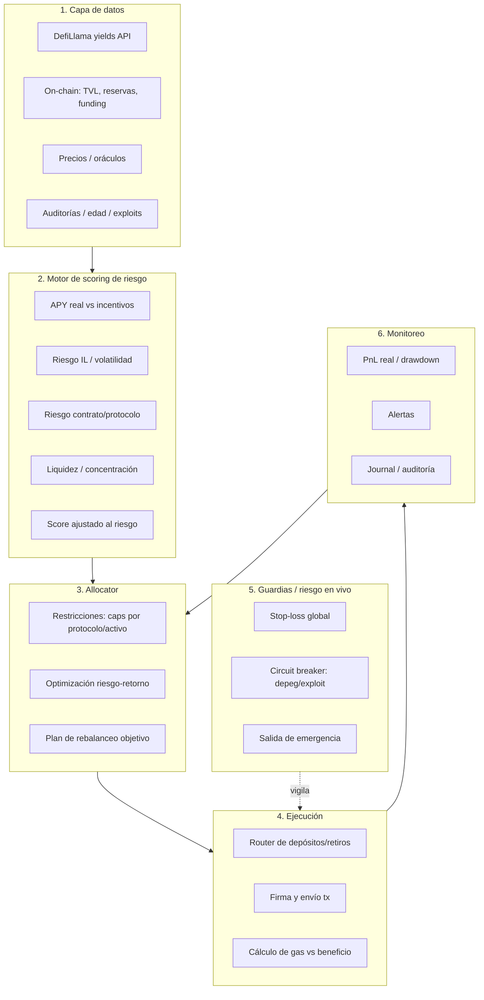

# Investigación: crecimiento de capital sostenible en DeFi

Respuesta profunda y basada en datos a: *"¿existe una estrategia DeFi
sostenible que se acerque al 1% diario, y cuál es la mejor arquitectura para un
sistema que rote capital maximizando el rendimiento ajustado al riesgo?"*

> TL;DR — **1% diario sostenido no existe** (es matemáticamente imposible a
> mediano plazo). Lo que sí existe y es replicable: una cartera que combine
> lending, yield fijo, y estrategias delta-neutral/funding para sostener
> **~10–25% ANUAL** con riesgo controlado, y ocasionalmente más en mercados
> favorables. Compuesto durante años, eso ya es de élite. Abajo, los datos, quién
> lo hace, y la arquitectura del sistema.

---

## 1. ¿Existe el 1% diario sostenible? El mercado lo impide (no "la matemática")

1% diario compuesto = **(1.01)^365 ≈ 37.8x al año** (+3.678%). En dos años,
$1.000 → $1.4 millones. En cuatro, superaría el market cap de todo el mercado
cripto.

**Precisión importante:** no es que "la matemática lo prohíba" — la matemática
solo *describe* lo insostenible que sería. La barrera real es **económica y de
mercado**: si alguien pudiera sostener 1% diario con capital significativo,
entraría más dinero, se llenaría el trade, desaparecería la ineficiencia,
bajarían los rendimientos y aparecerían competidores. Es el **límite de
capacidad + eficiencia de mercado**, no una ley absoluta. (Un edge chiquito y
efímero *puede* dar >1% diario un rato; lo que no existe es sostenerlo a escala
y en el tiempo.)

Por eso tu propia investigación acertó: **todo lo que muestra >1% diario es una
campaña temporal de incentivos** (emisiones de AERO, puntos, airdrops), no
comisiones reales. El APY se desploma cuando el incentivo termina. La regla:

> **APY sostenible ≈ comisiones reales + interés real. Todo lo demás es un
> subsidio con fecha de vencimiento.**

Referencia de contexto: los mejores fondos cuantitativos del mundo hacen
**15–40% ANUAL**. 1% diario es ~30–200x eso, de forma sostenida. No es una meta;
es la firma de un Ponzi.

---

## 2. La escalera de rendimientos REALES (con datos)

De menor a mayor riesgo — rangos observados 2024–2026:

| Estrategia | APY sostenible | De dónde sale el yield | Riesgo principal |
|---|---|---|---|
| **Lending de stablecoins** (Aave, Morpho, Compound) | **4–7%** | Interés real de prestatarios | Contrato, mala deuda, depeg |
| **Yield fijo** (Pendle PT de stables) | **4–5% fijo**, 8–25% con puntos | Tasa fija comprada con descuento | Contrato, liquidez al vencer |
| **Delta-neutral / funding** (Ethena sUSDe, basis) | **~11% prom** (rango 4–35%) | Funding de perps + staking | Funding negativo, exchange, colateral |
| **Funding arb profesional** (Hyperliquid/CEX) | **8–20%** (19% en 2025, DD 0.8%) | Diferencia de funding entre venues | Liquidación, ejecución, basis |
| **LST / restaking** (stETH, EigenLayer) | **3–5% + puntos** | Staking de ETH + AVS | Slashing, contrato, iliquidez |
| **Vaults auto-rotativos** (Yearn v3, Beefy) | **12–18%** (25%+ en bull) | Combinan lo de arriba | Riesgo compuesto de estrategias |
| **LP de stables correlacionados** (USDC/USDT) | **3–10%** | Comisiones de swaps | IL leve, depeg |
| **LP concentrado volátil + incentivos** (tu USDC-VELVET) | **espejismo** (miles %) | 95–99% emisiones | IL alto, colapso de APY, rug |

**Conclusión de la escalera:** el techo *sostenible y replicable* está en torno
a **10–25% anual** para una cartera bien gestionada. Pasar de ahí exige asumir
riesgo real de pérdida del principal.

Sobre los pools que encontraste:
- **WETH-USDC, USDC-cbBTC**: pares "blue-chip" con **volumen real** → APY más
  bajo pero más legítimo y sostenible. Mejor base que VELVET.
- **USDC-VELVET, WETH-TRAC**: APY inflado por incentivos → temporal.

---

## 3. Quién ya hace esto (no hay que inventar la rueda)

- **Ethena** — sintético dólar delta-neutral (long stETH / short perp). El diseño
  de "capturar funding + staking" empaquetado. sUSDe rindió 4–35% según el ciclo.
- **Yearn v3** — vaults modulares que **rotan capital automáticamente** entre
  Aave, Curve/Convex, Morpho, según el mejor rendimiento ajustado al riesgo. Es
  **exactamente la arquitectura que querés**, ya en producción (yvUSDC 12–18% en
  2024).
- **Beefy** — auto-compounding multichain en 15+ redes.
- **Pendle** — mercado de yield fijo/variable; permite "fijar" tasas.
- **Mesas cuantitativas / market-neutral** (desks OTC, algunos DAOs): funding
  arbitrage y basis trades, ~8–20% anual con drawdowns chicos cuando se hace bien.

La lección: **la infraestructura para rotar capital ya existe**. La ventaja no
está en "encontrar el pool mágico" sino en la **gestión de riesgo y la rotación
disciplinada**.

---

## 4. La estrategia realista: núcleo + satélite, compuesto

En vez de perseguir un número imposible, la forma más realista de **acelerar el
interés compuesto minimizando el riesgo del principal** es una cartera por capas:

```
                 CAPITAL
                    │
   ┌────────────────┼────────────────┐
   │ NÚCLEO 60–80%  │ SATÉLITE 15–30% │ APUESTA 0–10%
   │ (preservar)    │ (rendir)        │ (asimétrica)
   ├────────────────┼─────────────────┼──────────────┤
   │ Lending stables│ Delta-neutral   │ LP incentivado
   │ Yield fijo     │ Funding arb     │ (VELVET etc.)
   │ (4–7%)         │ Vaults (10–20%) │ con STOP duro
   └────────────────┴─────────────────┴──────────────┘
   Blended objetivo: ~8–18% anual, con downside acotado.
```

- **Núcleo** protege el principal y compone lento y seguro.
- **Satélite** es donde vive el rendimiento ajustado al riesgo (delta-neutral,
  funding, vaults auto-rotativos).
- **Apuesta** es la parte que *puede* pegar un 1%/día por un tiempo (incentivos),
  pero con tamaño chico y stop-loss duro — que si se va a cero, no te toca el
  núcleo. **Ahí encaja el bot de Aerodrome que ya construimos.**

El interés compuesto hace el trabajo: **15% anual reinvertido = 2x en ~5 años,
4x en ~10**. No es 37x/año, pero es real y no te funde.

---

## 5. Arquitectura del sistema de rotación automática

Diseño de un allocator que mueve capital entre oportunidades por rendimiento
**ajustado al riesgo** (no por APY bruto). Inspirado en Yearn v3, pero como
sistema propio y multi-protocolo.



**Componentes clave (y decisiones de diseño):**

1. **Capa de datos** — DefiLlama (yields, TVL) + lecturas on-chain (reservas,
   funding rates, estado de pools) + oráculos de precio. **Crítico:** separar
   *APY base (comisiones reales)* de *APY por incentivos*. DefiLlama ya expone
   `apyBase` vs `apyReward` — **el filtro #1 es exigir apyBase razonable**.

2. **Motor de scoring de riesgo** — el corazón. No perseguir APY; puntuar cada
   oportunidad por:
   - % del APY que es real (apyBase / apyTotal),
   - TVL y profundidad de liquidez,
   - volatilidad del par / riesgo de IL,
   - edad del protocolo, auditorías, historial de exploits,
   - concentración de holders / centralización.
   Salida: un **score ajustado al riesgo** (tipo Sharpe on-chain).

3. **Allocator** — optimiza la distribución sujeto a **restricciones duras**:
   caps por protocolo (ej. máx 25% en uno), por activo, por tipo de riesgo.
   Nunca "all-in" en la mejor oportunidad. Rebalancea solo si la mejora supera
   el costo de gas + slippage (evitar churn).

4. **Ejecución** — router que hace depósitos/retiros, con chequeo
   **gas-vs-beneficio** (no mover $50 para ganar $0.10). Idealmente sobre L2s
   baratas (Base, Arbitrum).

5. **Guardias en vivo** — lo más importante para "no perder el principal":
   - **Stop-loss global** (ej. −15% → todo a stables).
   - **Circuit breaker**: si un activo depega o hay señal de exploit, salida
     inmediata de ese protocolo.
   - **Salida de emergencia** manual siempre disponible.

6. **Monitoreo** — PnL real, drawdown, alertas, y un **journal** de cada decisión
   (auditable). Medir contra un benchmark (ej. "solo lending en Aave").

**Filosofía:** el sistema **no maximiza APY, maximiza retorno ajustado al riesgo
con topes de pérdida.** Prefiere 12% estable a 200% que se puede evaporar.

---

## 6. Expectativa realista y hoja de ruta

**Objetivo honesto:** ~**10–20% anual** blended, con drawdowns controlados. En
mercados alcistas con funding alto, picos temporales más arriba. Eso, compuesto,
es transformador en 3–5 años — y **no te funde el principal**.

**MVP incremental (sobre lo que ya tenemos):**

1. **Núcleo primero** — un módulo simple que ponga stables en Aave/Morpho y
   auto-compounde. Aburrido, seguro, base del sistema. *(1–2 días)*
2. **Scoring de riesgo** — pull de DefiLlama filtrando por `apyBase`, TVL, edad.
   Ranking de oportunidades ajustado al riesgo. *(el cerebro)*
3. **Allocator con caps** — distribuir entre núcleo + 2–3 satélites con límites.
4. **Delta-neutral / funding** — integrar una pata market-neutral (Ethena sUSDe
   como versión "empaquetada" y simple, o funding arb propio más avanzado).
5. **Guardias** — stop-loss global y circuit breakers **antes** de escalar monto.
6. El **bot de Aerodrome** ya construido = el módulo "satélite/apuesta" de alto
   riesgo, con tamaño chico y stop duro.

---

## Fuentes

- [Ethena — mecanismo delta-neutral y APY](https://eco.com/support/en/articles/14796324-inside-ethena-usde-delta-neutral-mechanism) · [revenue](https://docs.ethena.fi/solution-overview/protocol-revenue-explanation) · [APY 2026](https://earnpark.com/en/posts/ethena-fees-apy-interest-rates-explained-2026/)
- [Funding rate arbitrage 8–20% APY](https://arbitragescanner.io/blog/crypto-funding-rate-arbitrage-guide) · [market-neutral ¿funciona?](https://www.tv-hub.org/guide/market-neutral-strategy-crypto)
- [Aave lending 4–7%](https://aave.com/) · [mejores yields DeFi 5–15%](https://investingwithai.com/best-defi-yields-2026/) · [stablecoin yield masterclass](https://fibo-crypto.fr/en/blog/stablecoin-yield-defi-masterclass-guide-2026/)
- [Pendle / Aave / Morpho comparados](https://www.pistachio.fi/blog/best-defi-yield-platforms-2026)
- [Yearn v3 / Beefy auto-rotación](https://www.dextools.io/news/top-5-defi-yield-aggregators-auto-compound-2026) · [vaults 2025](https://www.tokenmetrics.com/blog/top-yield-aggregators-vaults-2025)

*Nada de esto es asesoramiento financiero. Rendimientos pasados no garantizan
resultados futuros. En DeFi siempre podés perder el principal.*
